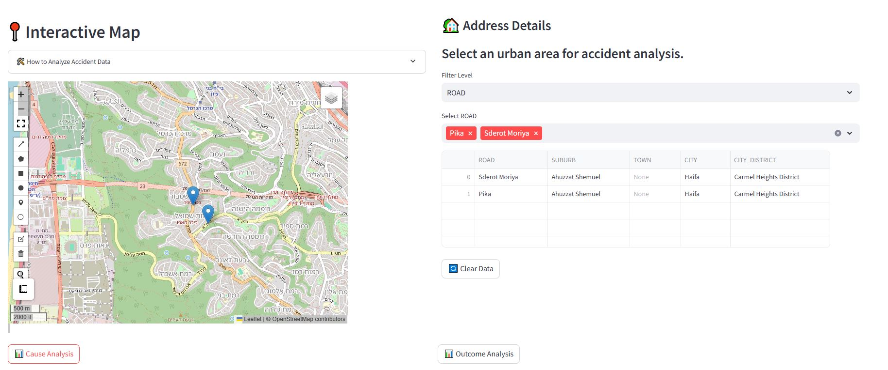
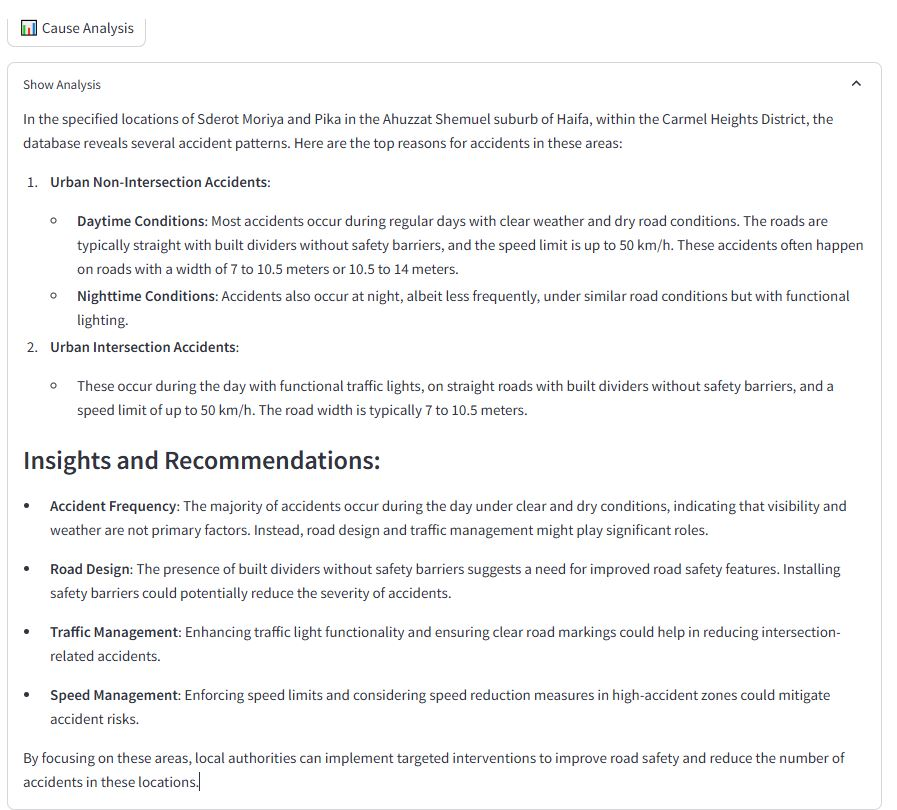
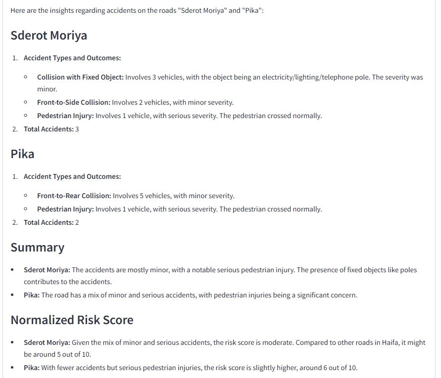

🚦 Accident Data Analysis with Streamlit & LangChain
---
📌 Overview

This project is a Streamlit-based web application that allows users to analyze accident data from Lamas (Israel) using an SQL Agent powered by the LangChain framework. The app enables users to select a specific location on an interactive map and retrieve insightful accident data analytics for that area.

Visit the app: [Car Acccident App](https://caraccidents.streamlit.app/)

✨ Features
- Interactive Map Selection: Users can manually select a location on a map to fetch accident data.
- SQL Agent-Powered Analysis: Utilizes the LangChain framework to interact with an SQL database and generate insights.
- Custom Queries: Provides AI-assisted queries to explore accident patterns, statistics, and trends.
- User-Friendly Interface: Built with Streamlit, ensuring a simple yet powerful user experience.

🗺️ Usage Guide
- Open the application in your browser.
- Use the interactive map to select a region.
- The SQL Agent fetches and analyzes accident data for the chosen location.
- View insights such as accident frequency, severity, and contributing factors

# Screenshots
---
### Main Screen - Manually selecting locations to analyze


### Main Screent - Acccident Cause Analysis Summary


### Main screen - Acccident Outcome Analysis Summary


# Own Usage

This project requires specific environment variables to securely connect to external services, namely the Supabase database and the OpenAI API.

## Environment Variables
### Supabase
To interact with your Supabase project (which includes a PostgreSQL database), you need to set the following variables:

- **`SUPABASE_URL`**: The URL of your Supabase project.
- **`SUPABASE_KEY`**: The API key for your Supabase project.
- **`DATABASE_URL`**: The connection string for your PostgreSQL database.
- **`DB_PASSWORD`**: The password for your PostgreSQL database.

### OpenAI

To use the OpenAI API, you need to provide:

- **`OPENAI_API_KEY`**: Your OpenAI API key.

## Setting Up Environment Variables

You can set these variables directly in your system or use a `.env` file (with a package like [python-dotenv](https://pypi.org/project/python-dotenv/) for Python projects). For example, create a `.env` file in the root directory of your project with the following content:

```dotenv
SUPABASE_URL=your_supabase_url_here
SUPABASE_KEY=your_supabase_key_here
DATABASE_URL=your_database_url_here
DB_PASSWORD=your_database_password_here
OPENAI_API_KEY=your_openai_api_key_here
